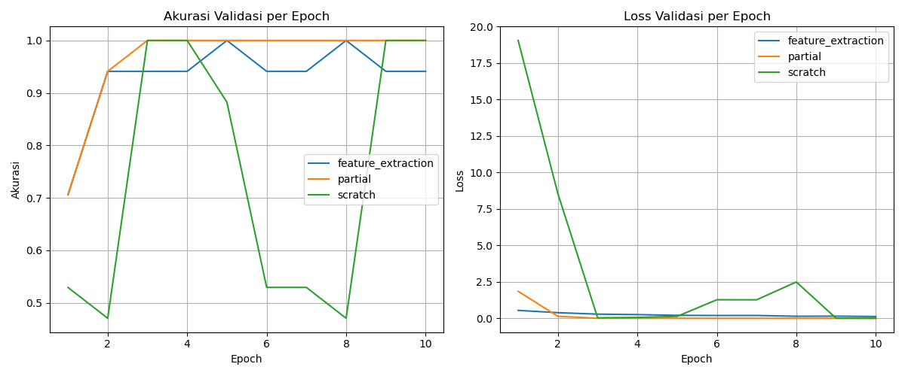

# RET503 - Computer Vision (Transfer Learning ResNet-18)

Repositori ini berisi kode program dan hasil praktikum klasifikasi objek kustom (`hp` vs `mouse`) menggunakan PyTorch.

## Struktur File
* `capture.py`: Ambil dataset foto lewat webcam internal (index 2).
* `split.py`: Pemisahan dataset otomatis ke folder `train` dan `val` (rasio 80:20).
* `train.py`: Pelatihan model ResNet-18 untuk 3 pendekatan (Feature Extraction, Partial Fine-Tuning, Scratch).
* `latency.py`: Pengujian waktu inferensi dan FPS antara ResNet-18 vs MobileNetV3-Small pada CPU.
* `test_cam.py`: Skrip pengujian deteksi objek secara real-time.

---

## Hasil Eksperimen

Pengujian dilakukan sebanyak 10 epoch pada laptop ThinkPad T480s (Intel CPU):

### 1. Perbandingan Strategi Training

| Pendekatan | Akurasi Val Maksimal | Waktu Training | Catatan |
| :--- | :---: | :---: | :--- |
| **Feature Extraction** | 100.00% | ~104s | Paling stabil dan hemat daya karena hanya melatih layer `fc`. |
| **Partial Fine-Tuning** | 100.00% | ~158s | Konvergensi paling cepat, nilai loss validasi paling kecil (0.0001). |
| **From Scratch** | 100.00% | ~212s | Membutuhkan waktu paling lama dan nilai loss sempat fluktuatif di epoch awal. |

### 2. Pengukuran Latensi (CPU Mode)

* **ResNet-18**: Rata-rata latensi ~104 ms/frame (~9.6 FPS)
* **MobileNetV3-Small**: Rata-rata latensi ~18 ms/frame (~54.6 FPS)

> **Kesimpulan:** MobileNetV3-Small jauh lebih ringan dan cocok diterapkan pada perangkat dengan resource terbatas (edge device) dibanding ResNet-18.

---

## Grafik Performa

